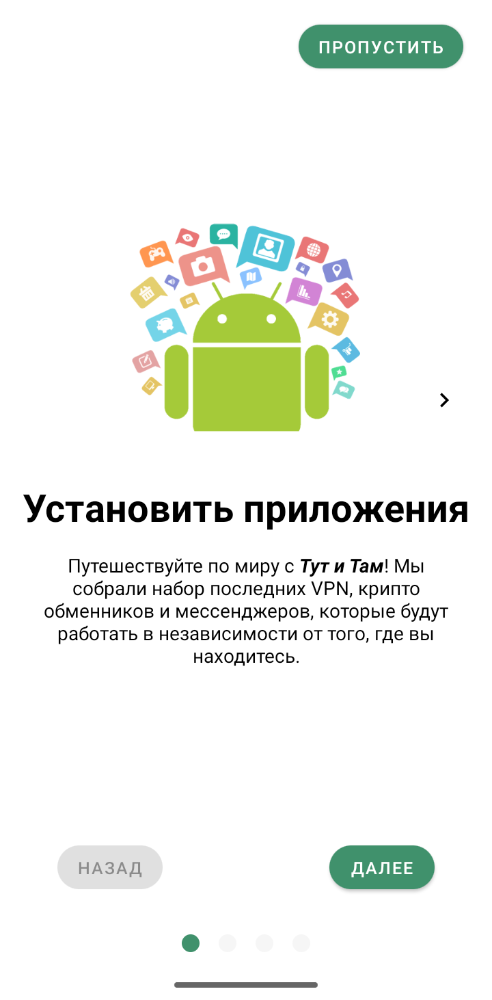
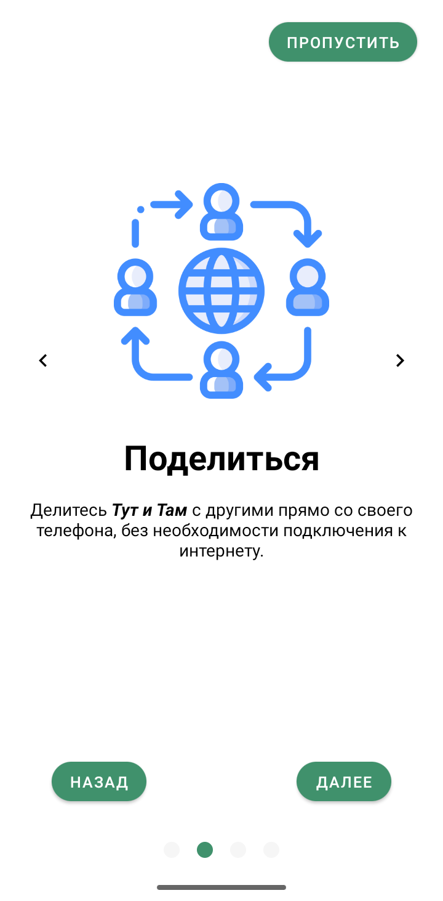
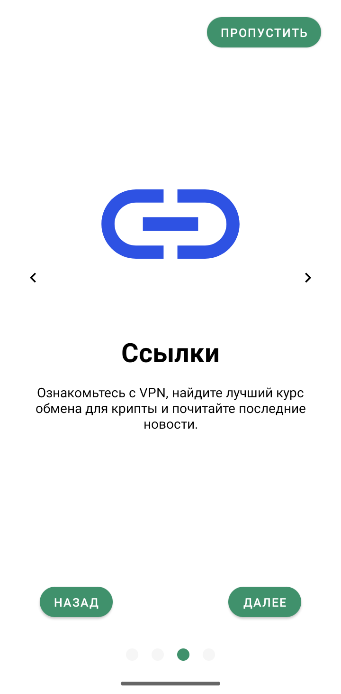
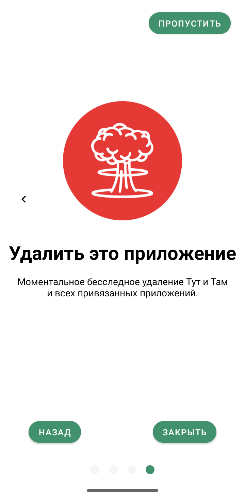
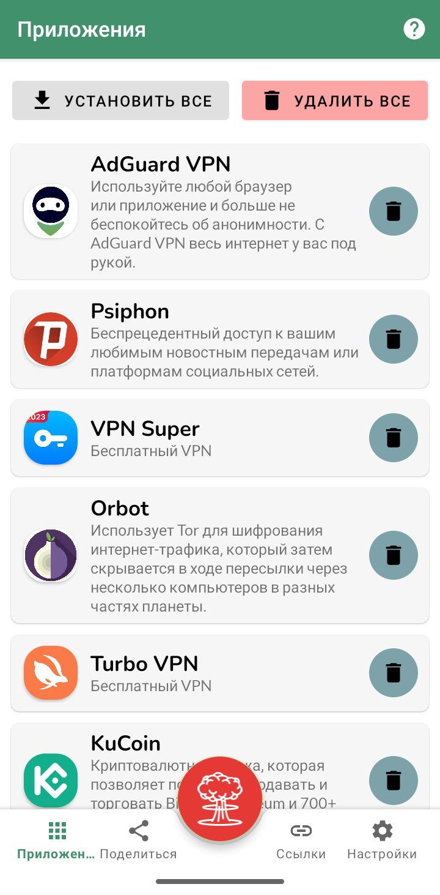
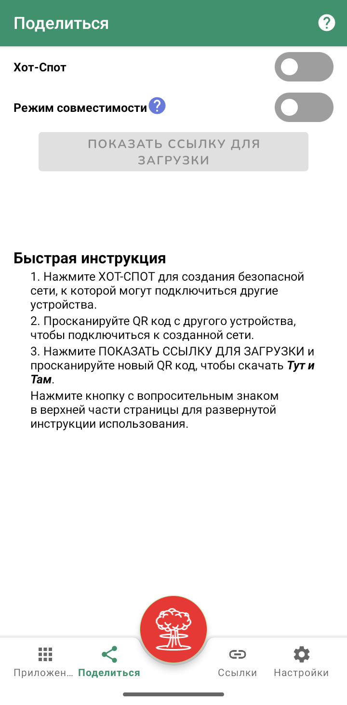
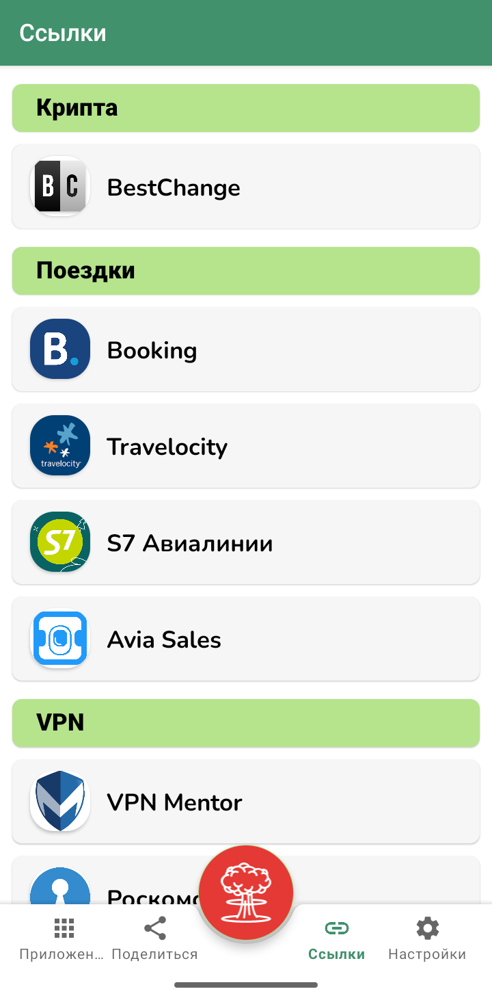
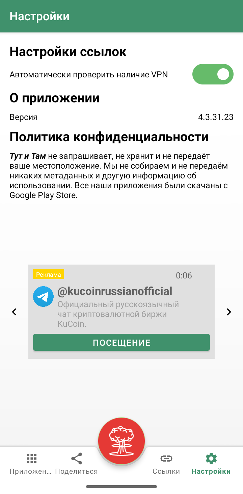

   
  
  <h1>Тут и Там</h1>
   
  <b>Открывайте контент, делитесь с друзьями, путешествуйте вместе!</b>

Создатель медиа приложения Стрим желает обезпечить свободу доступа к информации во время поездок и путешествий. Скачайте новое приложение **Тут и Там** для приватного доступа к букингу и другим приложениям в любое время и любом месте.

## Скачать: [tutitam.apk](https://github.com/TutitamTravel/tutitam/releases/download/4.3.31.23/tutitam.apk)

**Тут и Там** - это сборник всего необходимого для поездок и путешествий. **Тут и Там** включает в себя бесплатные VPN, позволяя осуществить приватное соединение со всем миром для доступа к любимым приложениям без ограничений или надзора третьих лиц. Устанавливайте и удаляйте привязанные приложения в любое время и без подключения к интернету. Ищите скидки на билеты и бронируйте гостиницы с включенными ссылками. **Тут и Там** также включает в себя криптокошелек для расходов за рубежем. Используйте функцию *поделиться* для того, чтобы приватно отправить **Тут и Там** своим друзьям и планируйте поездки вместе. Скачивайте, делитесь, путешествуйте!

Следущие приложения включены в **Тут и Там**:
* AdGuard VPN
* Psiphon
* VPN Super
* Orbot
* Turbo VPN
* KuCoin
* WhatsApp

 
 
 
  
